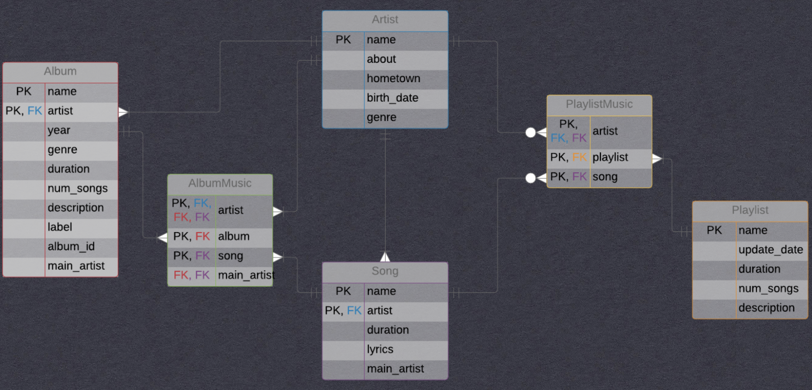

# База данных музыкального стримингового сервиса

Проект решает большую часть проблем, касающихся хранения и взаимодействия с данными, которые приходится решать разработчику любого музыкального сервиса, например:

1. Как хранить музыку в рамках альбомов, плейлистов и страниц исполнителей без копий?
2. Композиции и альбомы, у которых несколько исполнителей: как отличить, кто главный, а кто на фите?
3. У нескольких исполнителей есть песни/альбомы с одинаковыми названиями: как понять, независимые они или созданы совместно?
4. Как при решении этих проблем обеспечить простую вставку новых данных с поддержкой целостности?
5. Как красиво отображать данные в удобном для пользователя виде?

Подробнее о решении этих и некоторых других задач можно посмотреть в [презентации](MusicServiceDatabase.pdf)

Для решения поставленных вопросов использовались различные возможности SQL, а именно:

- Представления
- Хранимые процедуры
- Триггеры

В качестве СУБД использовалась `PostgreSQL`.

|Модель хранения данных|
|:--------------------:|
||